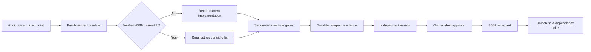

# Programs #589 Salvage Convergence Implementation Plan

> **For agentic workers:** Steps use checkbox (`- [ ]`) syntax for tracking. <!-- Note: subagent-driven-development and executing-plans skills are not available -->

**Goal:** Salvage PR #607 in place until the shared-shell contract owned by #589 has one fresh, candidate-bound machine/visual/review evidence bundle, then stop for explicit owner approval without unlocking #590–#601.

**Architecture:** Preserve the production-owned `ProgramsRouteSurface` and existing route/domain contracts. Execute five bounded salvage packets in the current PR #607 checkout: audit/fresh render, verified #589 fixes, sequential qualification, independent review, and owner decision. This file is the single source of truth for the active salvage state; the former R1–R8 packet ledger remains historical provenance only.

**Tech Stack:** Next.js App Router, React 19, TypeScript, Tailwind/CVA Screen Foundations, Storybook 10 with `@storybook/nextjs-vite`, MSW 2, Vitest/Testing Library, Playwright, Cloudflare Worker/D1, pnpm 11, Node.js 22.18.0.

## CEO Review Amendment — 2026-09-14

This amendment records the accepted `HOLD SCOPE` decision. It supersedes any conflicting execution instruction below while retaining the old R1–R8 records for audit history. `Status: DONE` means the review and plan decision are complete; it does not mean #589 code acceptance, owner approval, merge, or release is complete.

### Authority and delivery boundary

- Active package: #589 shared-shell salvage only. #590–#601 remain locked until #589 is accepted.
- Delivery owner: this chat session. Luna Max is a bounded implementor used one packet at a time; it cannot self-approve the candidate.
- Preserve PR #607 in place with append-only commits. Do not create another worktree, rebuild/split the PR, push, merge, close issues, release, or authorize downstream work.
- Plan-revision baseline observed before implementation: local branch `codex/programs-screen-foundations/wave-3`, local HEAD `0ca965214da9f1be41746435ad0f847ca2e6a977`, PR #607 OPEN, remote PR head `9ad90d253bfd50bf2bbcea85f39c18c1587b1f88`. These are audit observations, not a future candidate claim; S0 must re-read them.

### Acceptance order

Fresh renders and frozen-prototype comparison precede visual edits. The current UI is only the baseline; the accepted amendment and frozen prototypes govern shared-shell decisions.

### Visual approval contract

Commit exactly two shell contact sheets, `shell-402x874.png` and `shell-360x800.png`. Each sheet has frozen and actual columns for exactly these four shell states: Participant Directory, Management Directory, Workspace Settings overview, and Workspace Settings dirty/focused editor. The settings dirty/focused actual state uses the material Story; the frozen shell reference is `09-management-settings.html` because the frozen set has no separate dirty HTML. This is a shell-only comparison and does not approve deferred body content.

Keep the existing full-page matrix, raw logs, and traces local unless a failure requires diagnosis. Use machine checks—not manual inspection of every screenshot—for the `320–1440` responsive range. The contact sheets are the primary owner-approval surface.

### Error and gate policy

- Canonical Programs browser, responsive, and W7 failures block acceptance.
- Assertion, navigation, DOM, application, and regression failures block acceptance regardless of suite.
- A broad live-runtime failure is advisory only when the evidence proves it is solely the known Worker/Miniflare `HTTP 500 Network connection lost` harness condition. Name and record it even when advisory.
- Dirty-save protection remains a hard invariant: busy state prevents duplicate submission, dirty state remains until authoritative success, navigation interception stays active, and late responses after unmount are ignored.

### Durable evidence contract

At the candidate fixed point, commit a manifest and checksums, the two shell contact sheets, an acceptance ledger, and the owner-decision record. The manifest must identify the immutable production candidate SHA and artifact checksums. An evidence-only commit may follow the production fixed-point commit; it must not be treated as a new production candidate. Never claim owner approval, merge, release, or downstream authorization from machine evidence.

## Global Constraints

- Work only in `/Users/noah.wong/Desktop/code/efcc` on `codex/programs-screen-foundations/wave-3`. Preserve the four pre-existing dirty documentation paths; do not overwrite or clean them as part of this salvage.
- Treat #589 as the only active package. Do not start #590–#601 or alter their body workflows.
- Re-read local HEAD, branch, remote PR head/base, PR state, and dirty paths at every packet claim. A mismatch is a disclosed blocker before edits.
- Keep production changes append-only and minimal. Do not rewrite history, force-push, create a second worktree, or mutate GitHub state.
- Read the web UI governance and relevant Next.js guidance before production UI edits. Write/update the acceptance trace before implementation changes.
- The accepted amendment and `docs/design/programs-screen-foundations-v1/*.html` are visual authority for the shared shell. Fresh actual renders expose divergence; they do not redefine the design.
- Repair only verified #589 concerns: management-capability-gated mode switch; exact participant/management root navigation; header and Back ownership; Programs navigation label/active treatment; safe-area/fixed-navigation clearance/touch-target/overflow behavior; and notification action placement/visibility in the shared shell.
- Replace the non-semantic named region with an observable native semantic section. Remove the boundary complexity suppression only after measuring the actual lint failure and performing the minimum extraction proven necessary; do not preselect a three-component decomposition.
- The current measured `web/lib/programs/programs-boundary.tsx` findings are part of the repair packet: `no-shadow` in `syncSearch`, missing `routeQuery` in `react-hooks/exhaustive-deps`, and `ProgramsBoundaryBody` complexity `21` versus max `20` when its suppression is removed. Do not add suppression, baseline weakening, source-reading suppression tests, or Tailwind class-string assertions.
- Component tests must assert observable semantics: accessible name, capability visibility, icon direction, exact destination, and semantic region. Browser checks must assert computed geometry, not implementation class strings.
- Measure cold-load management-access request count before modifying the loader. Change the existing access loader only when duplicate requests are proven and no smaller fix meets the requirement; do not introduce a new provider architecture speculatively.
- Run stateful browser, responsive, and W7 suites sequentially where shared Next/Storybook state can contend. Keep code fixed point, candidate-bound evidence, independent review, and owner approval as separate gates.
- Run commands through `fnm exec --using 22.18.0`. Machine qualification is not owner approval. The terminal state before approval is `WAITING_OWNER_L2`, otherwise `CHANGES_REQUIRED / NOT_ROUTE_GREEN` with the exact blocker.

## Historical Global Constraints (superseded by the CEO Review Amendment)

- Work only in `/Users/noah.wong/Desktop/code/efcc` on `codex/programs-screen-foundations/wave-3` unless the user explicitly changes the target.
- The original execution-start SHA remains `9ad90d253bfd50bf2bbcea85f39c18c1587b1f88`; all final fixed-point review and candidate diff claims cover that SHA through the exact candidate HEAD recorded when R8 starts.
- The audited recovery anchor is clean local HEAD `51baa5d28c2f73b690827f13f2af628933ce3b74`, five commits ahead of remote PR #607 head `9ad90d253bfd50bf2bbcea85f39c18c1587b1f88`. After this planning turn, the expected dirty state is only this master file and its eight untracked packet files. Re-read live branch, remote, PR, issue, CI, and dirty-worktree state before claiming R1.
- Preserve the five existing local commits. Add one append-only logical commit per recovery packet. Keep PR #607 based on `codex/programs-screen-foundations/wave-2`; preserve PRs #603, #604, and #606.
- Local implementation and verification are in scope. Push, PR-body mutation, merge, issue closure, `gap: null`, approval, and release remain outside this plan without fresh explicit authority.
- `docs/design/programs-screen-foundations-v1/*.html` controls presentation hierarchy, density, information architecture, and the workflows it explicitly depicts. Server-shaped data, authorization, URL/history, mutation, conflict, retry, audit, idempotency, enrollment, event, and schedule contracts remain authoritative.
- Preserve `ProgramsRouteSurface`, `ProgramsBoundary`, `WorkspaceRouteProvider`, `ScreenPageFrame`, `ScreenHeader`, `ScreenSection`, `ScreenRow`, `ScreenState`, `ScreenStatus`, and `ScreenEditor`. Reuse the existing API clients and error-copy mapping.
- Retain the ten existing Programs baseline exports, Story IDs, Screen IDs, PSNs, and `ISSUE-#601` gaps. Supporting material Stories remain outside the Screen Catalog baseline manifest.
- Primary visual viewports are `402x874` and `360x800`. W7 regression widths remain `320`, `390`, `600`, `799`, `800`, `1024`, and `1440`.
- Run application and test commands through `fnm exec --using 22.18.0`.
- Every behavior change starts with a regression assertion that fails against the current code for the intended reason. Make the smallest responsible change, then run focused green and the packet gate.
- Repository-standard code carries no lint suppression. Refactor the scenario dispatcher into named maps/helpers rather than retaining the current complexity waiver.
- Preserve unrelated dirty work. If live HEAD, base, remote, PR state, or overlapping dirty files differ from the ledger, record the mismatch and stop before editing.
- Status language is exact: `CHANGES_REQUIRED / NOT_ROUTE_GREEN` until every R8 machine gate and fixed-point review is green; `WAITING_OWNER_L2` only after that. Machine evidence never implies owner approval.

## File Structure & Changes

### Active salvage files

The active packet may touch only the smallest proven set below. S0 decides which existing shared-shell owner file is actually divergent; no three-component boundary decomposition is preselected.

| File | Active responsibility |
| --- | --- |
| `docs/superpowers/plans/2026-09-11-programs-route-fidelity-recovery-tracker.md` | Current salvage contract, packet ledger, and cold-resume state |
| `web/lib/programs/programs-boundary.tsx` | Capability-gated mode routing, header/Back ownership, semantic boundary, measured lint repair, and dirty-save invariants |
| One already-existing shared-shell owner among `web/app/globals.css`, `web/lib/nav-bar.tsx`, `web/lib/screen-foundations.tsx`, or the affected Programs route component | Only a fresh frozen/actual mismatch proven by S0; do not edit all candidates by assumption |
| `web/lib/copy.ts` | Canonical frozen Programs navigation label only |
| `web/lib/programs/programs-boundary.test.tsx` | Behavior-focused component regressions: accessible name, capability visibility, icon direction, exact destination, semantic region |
| `web/lib/app.test.tsx` | Shared ShellHeader capability and global notification-action regressions |
| `web/lib/shell/authenticated-shell.test.tsx` | Shared-shell navigation label and capability-visible action regressions |
| `web/lib/shell-header.tsx` | Shared shell header ownership only when S0 proves a route-owned action diverges from the frozen shell |
| `web/lib/programs/program-api.ts` | Existing access-loader request deduplication only when the S0 request probe proves duplicate cold-load requests |
| `tests/e2e/programs-management-acceptance.test.ts` | Canonical authenticated cold-load access request-count regression and management route acceptance |
| `tests/e2e/programs-responsive-matrix.test.ts` | Computed shell geometry, fixed-region placement, touch targets, and responsive overflow |
| `tests/e2e/programs-visual-fidelity.test.ts` | Shell-only four-state contact-sheet generation at the two approval viewports; existing full-page matrix remains supporting evidence |
| `docs/qa/2026-09-14-programs-589-salvage.md` | Acceptance trace, compact candidate ledger, gate classification, independent review, and owner decision |
| `docs/qa/artifacts/programs-route-fidelity/<candidate-short>/` | Candidate manifest/checksums, `acceptance-record.json`, and the two committed shell contact sheets |

Do not create new global providers, new API contracts, new baseline IDs, or new named boundary components unless S0 evidence proves a smaller existing seam cannot meet the accepted contract.

### Historical R1–R8 packet files

| File | Responsibility |
| --- | --- |
| `docs/superpowers/plans/2026-09-11-programs-route-fidelity-recovery-tracker.md` | Sole mutable task ledger, global constraints, cold-resume protocol, and final completion gate |
| `docs/superpowers/plans/programs-route-fidelity-recovery/R1-navigation-semantics.md` | Navigation landmark versus local-tab semantics recovery |
| `docs/superpowers/plans/programs-route-fidelity-recovery/R2-truthful-route-fixtures.md` | Dense Cantonese baseline data, correct scenario dispatch, and Story wiring |
| `docs/superpowers/plans/programs-route-fidelity-recovery/R2A-shared-shell-fidelity.md` | Frozen mobile Programs Bottom Nav treatment and role-specific destinations |
| `docs/superpowers/plans/programs-route-fidelity-recovery/R3-directory-and-copy-fidelity.md` | Compact Department Settings action/picker and Schedule copy correction |
| `docs/superpowers/plans/programs-route-fidelity-recovery/R4-participant-behavior-plays.md` | Participant, mode-switch, Event gate, Back, and Department Settings behavior evidence |
| `docs/superpowers/plans/programs-route-fidelity-recovery/R5-schedule-recovery-plays.md` | Events-to-Schedule and focused/stale/partial/resume behavior evidence |
| `docs/superpowers/plans/programs-route-fidelity-recovery/R6-settings-notifications-plays.md` | Settings dirty/conflict and Notifications retry/mark-read behavior evidence |
| `docs/superpowers/plans/programs-route-fidelity-recovery/R6A-settings-back-interception.md` | Bounded production repair for focused Settings Back interception through the shared ScreenHeader |
| `docs/superpowers/plans/programs-route-fidelity-recovery/R7-visual-evidence-harness.md` | Deterministic actual/frozen capture, geometry manifest, and contact-sheet harness |
| `docs/superpowers/plans/programs-route-fidelity-recovery/R8-fixed-point-qualification.md` | Full gates, durable visual evidence, base reproduction, fixed-point review, and QA truth |
| `docs/superpowers/plans/programs-route-fidelity-recovery/R8B-residual-acceptance-evidence.md` | Bounded Schedule/Notifications Play evidence repair after the R8 fixed-point review |
| `docs/superpowers/plans/programs-route-fidelity-recovery/R8D-settings-authoritative-reload.md` | Bounded Settings conflict reload/retry repair after the fresh R8 review |

### Historical production and evidence ownership (not active for #589 salvage)

| Packet | Primary files | Responsibility |
| --- | --- | --- |
| R1 | `web/lib/screen-foundations.tsx`, `web/lib/programs/workspace-participants-task.tsx`, focused component/E2E tests | Restore workspace `navigation`/`link` semantics while preserving explicit local `tablist`/`tab` behavior |
| R2 | `web/.storybook/programs-fixtures.ts`, route Story files, Story contracts, T11 | Replace sparse English/year-2099 data; fix scenario meanings and baseline handler selection |
| R2A | `web/app/globals.css`, `web/lib/shell/shell-breakpoint.test.tsx`, shell geometry tests if required | Match the frozen phone Bottom Nav indicator treatment while preserving role-specific destinations and desktop rail behavior |
| R3 | `web/lib/programs/management-directory.tsx`, `web/lib/copy.ts`, focused tests | Remove the persistent scope-launcher row, add one compact Department Settings action/picker, use `新增規則` |
| R4 | participant material Stories, stateful MSW handlers, Story/T11 contracts | Prove mode switch, Back, enroll/cancel/withdraw, Event CTA gate, and Department Settings selection |
| R5 | Schedule/Events material Stories and focused production/tests if red | Prove Events entry, editor Back, preview, stale recovery, partial generation, and resume |
| R6 | Settings/Notifications material Stories and focused production/tests if red | Prove dirty-state handling, conflict recovery, retry, unread state, and mark-read |
| R7 | dedicated Playwright visual spec/config and root script | Generate 11-case actual/frozen evidence without production or dependency changes |
| R8 | `docs/qa/2026-09-11-programs-route-fidelity-correction.md`, durable artifacts | Requalify the complete `9ad90d25...HEAD` candidate without hiding new implementation inside qualification |

The tables are ownership bounds, not an instruction to edit every named production file. A file stays unchanged when the new regression already passes and source inspection confirms the contract.

## What Already Exists

The current fixed point already contains the shared shell and route seams required for a bounded salvage: `ProgramsRouteSurface`, `ProgramsBoundary`, `ScreenPageFrame`, `ScreenHeader`, `ScreenTabs`, `NavBar`, the capability projection in `programs-access.ts`, the existing Programs component/browser/responsive suites, and the actual/frozen visual harness. S0 must render this candidate before deciding whether any of those owners need a change.

- `ProgramsRouteSurface` already owns `ScreenPageFrame + Suspense + ProgramsBoundary`, and both `/programs` and `ProgramsStoryHarness` consume it. Preserve this one-route composition.
- The ten retained baseline Stories and the 20 named material scenarios already exist. Their route identity and catalog governance are useful; their fixture truth and behavior evidence are incomplete.
- `projectManagementPrograms` already projects only server-returned authorized Programs and preserves explicit department narrowing.
- `ParticipantEnrollment`, participant Event Detail, `ProgramSettings`, Schedule preview/generate, stale-plan refusal, partial generation, retry/resume, and `ProgramsNotifications` already own the required domain behavior.
- The current QA file truthfully records `NOT_ROUTE_GREEN — CHANGES_REQUIRED — WAITING_OWNER_L2_NOT_REACHED`, fresh candidate-bound visual/gate evidence, exact base reproduction for the remaining T09/role-hierarchy limitation, and the unresolved owner-authority/Storybook spot-check boundary.

## Not In Scope

- New Worker routes, D1 migrations, API payload fields, capability names, enrollment/event/schedule states, or authorization widening.
- Rebuilding the Programs route composition, adding another router/provider, or creating a second fixture-backed leaf presentation path.
- New baseline IDs/PSNs, a full backend-state cross-product, or desktop pixel redesign.
- Rewriting/amending existing commits, rebasing, force-pushing, creating a child repair PR, or changing lower stacked PRs.
- Database schema/index changes, backend/API contract changes, permission-model redesign, or a new global access provider unless the request-count probe proves the existing loader cannot satisfy the requirement and a smaller fix is impossible.
- Real-device camera, QR, download, or print proof; manual approval of every full-page screenshot; or committing raw logs, traces, and the full-page visual matrix.
- #593 Management Directory body density/copy/workflows; #594 Workspace overview/body hierarchy; #598 Settings hub/editor content and broader copy; #599 notification destination/badge/content/flow; and #595, #596, #608–#613 schedule/event/approval/attendance/QR/camera/download/print behavior.
- Owner-L2 approval, merge, issue closure, release, downstream-ticket authorization, or converting `ISSUE-#601` to `gap: null`.

## ASCII Diagrams

### Active #589 salvage flow

~~~text
S0 audit + fresh frozen/actual render
          |
          +-- no verified shell mismatch --> S2 sequential qualification
          |
          '-- verified mismatch --> S1 smallest fix + focused green
                                      |
                                      v
                            S2 sequential machine gates
                                      |
                                      v
                         candidate-bound compact evidence
                                      |
                                      v
                              S3 independent review
                                      |
                                      v
                              S4 explicit owner decision
                                      |
                       approved -> #589 accepted -> unlock next
                       rejected -> new bounded salvage packet
~~~

### Historical execution and compaction state

~~~text
master ledger: ACTIVE = Rn
          |
          v
load Global Constraints + Rn only
          |
   red -> minimal change -> focused green -> packet gate
          |
          +-- context low / interruption --> append checkpoint
          |                                  update ledger next action
          |                                  resume from first unchecked box
          |
          '-- review -> one commit -> mark COMPLETE -> activate Rn+1
~~~

### Historical candidate evidence flow

~~~text
frozen HTML + approved route/domain contracts
                    |
       deterministic server-shaped fixtures
                    |
        ProgramsStoryHarness -> ProgramsRouteSurface
                    |                    |
              Story Play/T11      real Worker/D1 route
                    \                    /
                     responsive + visual
                             |
                   fixed-point two-axis review
                             |
                     WAITING_OWNER_L2
~~~

## Failure Modes & Gaps

### Current salvage-specific risks

- The previous R8 evidence is not candidate authority for this run. A fresh render, exact candidate SHA, and frozen comparison are required before retaining or changing shared-shell code.
- Removing the existing `ProgramsBoundaryBody` complexity suppression measured complexity `21` versus max `20`; the same audit found `no-shadow` and missing `routeQuery` in `react-hooks/exhaustive-deps`. These are measured repair inputs, not permission for broad refactoring.
- The `BoundaryFrame` named region is currently represented by a `div` plus an accessibility-role suppression. The accepted repair is an observable native semantic section and behavior-focused assertions.
- Full-page visual differences may belong to deferred screen bodies. They cannot block or approve #589 shell work until the shell crop isolates header/Back, notification action, and fixed navigation.
- The frozen prototype set has no separate dirty Settings HTML. The shell comparison must document the `09-management-settings.html` frozen shell reference and use machine behavior checks for the actual focused editor.
- The cold-load management-access request count is unmeasured at this salvage fixed point. Do not change the loader until a route-level probe proves duplicate requests.
- Existing lint findings in `screen-foundations.tsx` and `management-directory.tsx` are unrelated unless S0 proves a #589-owned regression; do not absorb them into this packet by default.
- A broad live-runtime failure may be advisory only after the exact `HTTP 500 Network connection lost` Worker/Miniflare condition is proven; all assertion, DOM, navigation, application, and regression failures remain blocking.

### Historical recovery gaps

- `ScreenTabs` currently hard-codes `role="tablist"` on a native `nav`, and `ScreenTab` defaults links to `role="tab"`. This removes the `管理工作` navigation landmark and fails the real responsive matrix.
- Baseline fixtures currently use one English department/program, year-2099 dates, sparse rows, empty notifications, and zero cockpit counts. A green route marker therefore does not prove prototype fidelity.
- `participant-directory-capable` currently routes to management, `participant-event-detail-ineligible` returns an HTTP 200 inactive event rather than the server-shaped forbidden surface, and `management-directory-mixed` is not mixed.
- `ManagementDirectory` currently renders one persistent Department Settings launcher per authorized department before the catalog. The frozen default route has one compact action and an aggregate authorized list.
- `COPY.programs.addRule` currently says `新增時間表`; the frozen Schedule action is `新增規則`.
- Most material Stories currently stop at a generic readiness assertion. They do not prove Back, mode switch, enrollment mutations, Event CTA gating, Schedule recovery, Settings conflict, or Notifications recovery.
- Current T09 and role-hierarchy failures were not base-reproduced. Because the candidate changes shared foundations/CSS, they cannot be called unrelated until R8 reproduces them at the original execution-start SHA.
- The existing visual files under `/tmp/efcc-task5-visual` are audit evidence only. R7 builds the deterministic harness; R8 must generate a fresh manifest and durable contact sheets tied to the final candidate SHA.

## Parallelization / Worktree Strategy

Execute S0 through S4 sequentially in the existing PR #607 checkout. This chat session owns the delivery state; Luna Max receives only the currently claimed bounded packet and cannot approve its own result. Do not create another worktree or split/rebuild PR #607. Stateful browser, responsive, W7, and visual runs are sequential because shared Next/Storybook state can contend. Independent review happens only after the production candidate is fixed and its compact evidence is immutable; owner approval happens only after that review. The former R1–R8 packets are historical context and are not parallel work to resume.

## Tracker State Model

Allowed transitions are:

~~~text
PLANNED -> IN_PROGRESS -> VERIFYING -> REVIEWING -> COMPLETE
                |             |            |
                +----------> BLOCKED <------+
                               |
                               +-> IN_PROGRESS
~~~

- Exactly one packet may be `IN_PROGRESS`, `VERIFYING`, or `REVIEWING`; these values mean ACTIVE. A parent packet may remain `BLOCKED` while one disclosed child packet is ACTIVE.
- `COMPLETE` requires every packet checkbox checked, the named gate result recorded, and exactly one matching unique commit subject after the packet's Start SHA. Git history—not a self-referential hash copied into this file—is the commit identity authority.
- `BLOCKED` requires exact evidence, the last safe state, and one concrete next action. When a bounded child packet can resolve it, `Active Task` moves to that child; otherwise `Active Task` names the blocked packet so the user can supply the missing authority/input.
- The ledger below is the only current-status authority. Packet checkpoint logs are append-only history and must not declare packet status.
- Change each packet checkbox from `[ ]` to `[x]` immediately when its `Complete when` condition becomes true; never batch progress updates at task end. Append checkpoints at claim, red, green, review, blocker, and every compaction/handoff boundary.

## Active Salvage Packets

The following packets supersede the historical R1–R8 execution sequence. Each packet is claimed, executed, reviewed, and committed before the next packet is activated. A packet that discovers a new defect returns to the smallest applicable packet with a new append-only commit; it never edits an earlier commit.

### Salvage Packet S0 — Audit and fresh evidence

**Purpose:** Establish the actual current fixed point and a fresh frozen/actual shell baseline before any visual or production edit.

**Precondition:** No production file has been edited for this salvage. The four existing dirty documentation paths remain preserved.

**Files:** `docs/qa/2026-09-14-programs-589-salvage.md`, generated local artifact directory, and this tracker ledger only.

**Steps:**

- [ ] Claim S0: run `git status --short --branch`, `git rev-parse HEAD`, `git log --oneline --decorate -10`, `git ls-remote origin refs/heads/codex/programs-screen-foundations/wave-2 refs/heads/codex/programs-screen-foundations/wave-3`, and `gh pr view 607 --json number,state,baseRefName,baseRefOid,headRefName,headRefOid,statusCheckRollup,url`; record exact results and stop on an unexpected overlap.
- [ ] Write the #589 acceptance trace and the S0 checkpoint before any production edit. Record the baseline candidate SHA separately from later docs-only evidence commits.
- [x] Run the existing actual/frozen visual harness at `402x874` and `360x800` against the current candidate. Capture the four required shell states with their frozen references; generate the authoritative shell-only sheets in S2. Do not treat the existing full-page matrix as the approval surface.
- [x] Capture the baseline harness manifest and compact shell-state locators with candidate SHA, route/story IDs, frozen file paths/hashes, viewport dimensions, and actual/frozen artifact paths. Keep raw screenshots, traces, and full-page sheets local.
- [x] Run the existing Programs component/route probes needed to establish baseline semantics: capability-gated management visibility, exact participant/management roots, Back/header ownership, notification action ownership, and the named region's accessible semantics.
- [x] Measure current lint without changing source. Remove the boundary complexity suppression only in a disposable inspection copy or equivalent reversible probe and record the exact `ProgramsBoundaryBody` complexity, `no-shadow`, and `react-hooks/exhaustive-deps` findings. Do not commit a suppression test or class-string assertion.
- [x] Measure cold-load `GET /api/v1/programs/access` requests in the existing route harness before the management route settles. Record count, request initiator/trigger, and candidate SHA. The Storybook probe proves a duplicate; the real Worker/D1 setup limitation is recorded separately.
- [x] Decide each potential shared-shell owner from fresh evidence. Record `RETAIN` when the current candidate matches; record a bounded S1 fix only for a verified mismatch.

**Gate:** Fresh actual/frozen four-state shell captures exist, the baseline is recorded, lint/request-count results are known, every proposed edit is tied to a verified mismatch or measured lint defect, and the S0 acceptance trace is durable. S0 may complete without a production commit; the compact shell-only contact sheets remain an S2 evidence deliverable.

### Salvage Packet S1 — Verified #589 fixes

**Purpose:** Apply only the smallest fixes proven by S0, with behavior-first tests and no speculative architecture.

**Precondition:** S0 is complete and its ledger identifies at least one red semantic/lint/geometry mismatch. If S0 finds no mismatch, skip production edits and activate S2.

**Files:** Only the proven existing owner files from `web/lib/programs/programs-boundary.tsx`, `web/app/globals.css`, `web/lib/nav-bar.tsx`, `web/lib/screen-foundations.tsx`, `web/lib/shell-header.tsx`, `web/lib/programs/program-api.ts`, `web/lib/copy.ts`, or the affected Programs route component, plus focused tests and the acceptance trace. Do not create a preselected three-component boundary decomposition.

**Steps:**

- [x] Add focused red regressions in existing tests before implementation. Assert observable semantics only: management switch visible iff `hasManagementCapability`; participant → management and management → participant exact root destinations; Back destination and single header/action ownership; correct icon direction; native semantic section and accessible name; notification action visibility/placement contract. Do not read source text, suppression comments, or Tailwind class strings.
- [x] Replace `BoundaryFrame`'s non-semantic named region with a native semantic `<section>` preserving its stable ID and accessible naming behavior. Remove the associated accessibility-role suppression.
- [x] Fix `syncSearch`'s shadowed local name and include the actual `routeQuery` dependency required by the hook. Preserve route normalization and history behavior.
- [x] Remove the `ProgramsBoundaryBody` complexity suppression through the minimum extraction proven necessary by the measured lint result. The extraction must preserve dirty-save busy/dirty/navigation/late-unmount behavior and must leave route ownership explicit. Add another extraction only if the first minimal change remains over the configured threshold.
- [x] Apply shared-shell CSS/navigation/header/notification changes only where S0's frozen comparison or computed checks identifies a #589 mismatch. Preserve the frozen mobile indicator, safe-area clearance, fixed-region placement, 44px targets, overflow behavior, and exact Programs label/current treatment.
- [x] Change `getManagementAccess` only after S0 proved duplicate cold-load requests; use the smallest existing-loader fix and no provider architecture.
- [x] Run focused component tests, the touched production lint, `git diff --check`, and a bounded diff review. Confirm no new suppression, baseline weakening, API/schema change, or unrelated lint debt entered the packet.
- [x] Commit the production fixed point as one append-only logical commit. Record its full SHA; this SHA—not a later artifact commit—is the candidate identity: `ea7a54ef5580f399d0db2c2c67795ce4689f71b0` (`fix(programs): salvage shared shell acceptance seams`).

**Gate:** Focused behavior tests are green, touched-file lint is clean at the configured rules, dirty-save invariants remain green, and the production diff contains only verified #589 fixes. If S0 found no production red, mark S1 `NOT NEEDED` in the ledger without fabricating a code commit.

### Salvage Packet S2 — Sequential machine qualification and compact evidence

**Purpose:** Qualify the immutable production candidate and commit only the compact evidence required for owner review.

**Precondition:** S1 production fixed point is committed, or S1 is explicitly recorded as not needed. Freeze the candidate SHA before evidence-only changes.

**Files:** `tests/e2e/programs-responsive-matrix.test.ts`, `tests/e2e/programs-visual-fidelity.test.ts`, `docs/qa/2026-09-14-programs-589-salvage.md`, and `docs/qa/artifacts/programs-route-fidelity/<candidate-short>/` only when the existing harnesses are the proven owners.

**Steps:**

- [x] Run focused component checks and typechecks at the frozen candidate. Run `pnpm --dir web typecheck` and root/e2e typecheck through `fnm exec --using 22.18.0` — `151/151` focused tests and both typecheck projects passed.
- [x] Run the canonical Programs browser suite, then the responsive suite, then W7/Storybook qualification sequentially. Use the repository's existing scripts and exact configured scopes; do not run stateful Next/Storybook suites concurrently — browser `3/3`, responsive `18/18`, W7 `126/126`, all with zero skipped/unexpected/flaky results. W7 was refreshed after the harness-only locator commit `d4165463c663f7b11d8e12eebc69b6d9df933b19` and a fresh Storybook restart.
- [x] Run the visual harness at both approval viewports against the frozen candidate and generate the two shell contact sheets. Each sheet must contain only the four required state pairs; retain full-page output locally for context/overflow diagnosis — `2/2`, 8 shell rows, two committed sheets.
- [x] Add or run browser assertions using computed behavior: `#main-navigation` fixed/sticky placement and safe-area clearance; `#shell-content` bottom padding; active indicator computed width `18px`, height `2px`, and radius `2px`; icon-button width/height at least `44px` with equal circle geometry; header action placement; and no horizontal overflow across `320`, `360`, `390`, `402`, `600`, `799`, `800`, `1024`, and `1440` where the existing matrix supports the check. Never assert Tailwind class names — all computed checks passed.
- [x] Re-run the cold-load management-access probe at the candidate and record the exact count. A single request is a retained-loader result; a proven duplicate is a blocking S1 defect unless repaired by the smallest existing seam — observed `1` request, expected `1`.
- [x] Classify every failure. Any assertion/navigation/DOM/application/regression failure blocks. A broad live-runtime failure is advisory only with evidence that it is exactly the known Worker/Miniflare `HTTP 500 Network connection lost` harness condition; record the condition and do not hide it — accepted candidate runs have no blocking/advisory failures; discarded harness diagnostics are recorded.
- [x] Run `git diff --check` and inspect the production diff against the frozen candidate SHA. Write `manifest.json` with candidate SHA, exact test results, route/story/frozen mappings, and SHA-256 checksums for committed artifacts. Write `acceptance-record.json` with stable criterion IDs, status, evidence paths, and failure classification.
- [x] Commit the manifest, checksums, two shell contact sheets, acceptance ledger, and owner-decision record as an evidence-only append-only commit. State clearly that this commit does not change the production candidate.

**Gate:** Every canonical gate is green or has the explicitly permitted advisory classification; all evidence is bound to the frozen production SHA; compact artifacts are committed; and the ledger says `MACHINE_GREEN / WAITING_INDEPENDENT_REVIEW`. Any blocking failure returns to S1 or remains blocked with an exact next action.

### Salvage Packet S3 — Independent review

**Purpose:** Obtain a fresh-context review that is separate from the delivery owner and candidate implementation.

**Precondition:** S2 has a frozen candidate, candidate-bound machine evidence, both shell contact sheets, manifest/checksums, and no unclassified blocker.

**Files:** Candidate production diff, committed compact artifacts, frozen prototype references, and `docs/qa/2026-09-14-programs-589-salvage.md`; reviewer output is recorded as a durable review note or linked result.

**Steps:**

- [ ] Give the independent reviewer the candidate SHA, diff range, acceptance contract, exact four-state contact sheets, machine checks, and known advisory runtime condition—without asking it to trust the delivery owner's conclusion.
- [ ] Require review of #589 scope only: shell fidelity against frozen authority, capability/root/header/Back/notification semantics, computed geometry, dirty-save invariants, request-count evidence, and accidental downstream scope.
- [ ] Record reviewer identity/context, candidate SHA, files/artifacts reviewed, findings with severity, and exact verdict. A review that is unavailable, stale, or self-authored is not a pass.
- [ ] If actionable findings exist, mark S3 blocked, return to the smallest S1 repair, create a new production candidate, and repeat S2/S3. Do not silently amend the reviewed candidate.

**Gate:** Independent review records zero actionable findings for the exact candidate and compact evidence bundle. Then set the ledger to `WAITING_OWNER_L2`; do not mark #589 accepted yet.

### Salvage Packet S4 — Explicit owner decision

**Purpose:** Place the compact approval surface in front of the owner and record the decision without broadening authority.

**Precondition:** S3 is independently clean and the candidate remains unchanged since review.

**Steps:**

- [ ] Present the two shell contact sheets, candidate manifest/checksums, acceptance ledger, machine gate summary, request-count result, advisory runtime classification if any, and independent review.
- [ ] Ask for one explicit owner decision on #589: approve the exact candidate, request changes, or leave pending. Do not infer approval from silence, prior plan approval, or machine-green evidence.
- [ ] Record the owner's decision, timestamp, candidate SHA, and any requested follow-up in the durable acceptance ledger. If rejected/requested changes, return to S1 with a new bounded packet.
- [ ] If approved, mark #589 accepted and unlock only the next dependency ticket in a subsequent explicitly authorized decision. Do not push, merge, close, release, or authorize downstream implementation in this packet.

**Gate:** Explicit owner approval is recorded for the exact candidate. Until then the terminal state is `WAITING_OWNER_L2`, not accepted.

## Active Task

`S3`

## Salvage Task Ledger

| ID | Packet | Status | Start SHA | Unique commit subject | Required gate | Evidence / blocker / next action |
| --- | --- | --- | --- | --- | --- | --- |
| S0 | Audit and fresh evidence | COMPLETE | `0ca965214da9f1be41746435ad0f847ca2e6a977` | `—` | Fresh four-state shell baseline, lint/request-count probe, acceptance trace | Complete; Storybook proves two concurrent access GETs and frozen comparison proves nav/header mismatches; real Worker/D1 setup limitation recorded |
| S1 | Verified #589 fixes | COMPLETE | `0ca965214da9f1be41746435ad0f847ca2e6a977` | `ea7a54ef5580f399d0db2c2c67795ce4689f71b0` — `fix(programs): salvage shared shell acceptance seams` | Focused behavior tests + touched-file lint + bounded diff | Complete at the append-only production fixed point; hook passed the full required repository gates, including 69 component files / 1039 tests |
| S2 | Sequential qualification/evidence | MACHINE_GREEN / WAITING_INDEPENDENT_REVIEW | `ea7a54ef5580f399d0db2c2c67795ce4689f71b0` | `ed4e484ee565c6bcdb13484a88b3aa1de892c994` — `test(programs): record #589 salvage evidence` | Browser `3/3` → responsive `18/18` → W7 `126/126`, computed geometry, request count `1/1`, shell contact sheets | Compact candidate evidence committed; harness-only Story Play repair `d4165463c663f7b11d8e12eebc69b6d9df933b19` followed by fresh-server W7 `126/126`; production candidate remains `ea7a54ef...`; no accepted blocking/advisory failures |
| S3 | Independent review | IN_PROGRESS | `ea7a54ef5580f399d0db2c2c67795ce4689f71b0` | `—` | Fresh-context zero-actionable review | Review exact candidate and compact evidence; delivery owner cannot self-approve |
| S4 | Owner decision | PLANNED | `—` | `—` | Explicit owner approval for exact candidate | Remains `WAITING_OWNER_L2` until user decides |

## Historical Active Task (superseded)

`R8`

## Historical Task Ledger (superseded by Salvage Task Ledger)

| ID | Packet | Status | Start SHA | Unique commit subject | Required gate | Evidence / blocker / next action |
| --- | --- | --- | --- | --- | --- | --- |
| R1 | [Navigation semantics](programs-route-fidelity-recovery/R1-navigation-semantics.md) | COMPLETE | `51baa5d28c2f73b690827f13f2af628933ce3b74` | `fix(programs): restore navigation semantics` | focused components + `test:programs:responsive` | Downstream query corrected; focused 49/49 and full 69 files / 1,020 tests pass; responsive matrix passes at `test-results/programs-responsive/20260911t073743813z`; expanded diff review is clean; append-only commit is ready |
| R2 | [Truthful route fixtures](programs-route-fidelity-recovery/R2-truthful-route-fixtures.md) | COMPLETE | `8fb468803c03e791645b9b6c81b0c43ab824db0a` | `test(programs): make route fixtures truthful` | Story contracts + T11 | Closeout prepared after Steps 1–10; contract/catalog 23/23, Event component 33/33, Storybook 93/93, T11 99/99 across 9 viewports, typecheck, diff/format/source review all pass; verify the single matching commit subject after commit |
| R2A | [Shared shell fidelity](programs-route-fidelity-recovery/R2A-shared-shell-fidelity.md) | COMPLETE | `1c92a346ffa3a42feab546d20d234220f0a266ac` | `fix(shell): match programs prototype navigation treatment` | focused shell + responsive + visual comparison | Closeout prepared: red regression reproduced; focused 76/76, shell responsive 92 passed/1 skipped, shell geometry 35/35, Programs responsive passed, full components 69 files/1,021 tests, typecheck, and 402x874/360x800 member+management screenshot/computed-style review all pass; verify one matching commit after Start SHA |
| R3 | [Directory and copy fidelity](programs-route-fidelity-recovery/R3-directory-and-copy-fidelity.md) | COMPLETE | `a7ed416e639f706e07602d35ea26e85459b45323` | `fix(programs): align directory and schedule copy` | focused components + Story contracts | Post-commit verified: exactly one matching subject at `1529e5f8d51c56c9e2c20aebfe0a3c99f97cb8c3`; full hook passed typecheck, Storybook scope, governance, Programs gates, root/worker suites, and 69 component files / 1,026 tests; worktree clean; remote and PR #607 unchanged; no remote write authorized |
| R4 | [Participant behavior Plays](programs-route-fidelity-recovery/R4-participant-behavior-plays.md) | COMPLETE | `1529e5f8d51c56c9e2c20aebfe0a3c99f97cb8c3` | `test(programs): exercise participant route seams` | Storybook + participant T11 slice | Committed at `b0b6356b2ba59b599b9844ee016653f7d2c08ad0`; exactly one matching subject after Start SHA; stateful factory regressions, named route Plays, Storybook `94/94`, foundation `59/59`, focused components `51/51`, T11 `108/108` across 9 W7 viewports, full hook, typechecks, formatter, diff check, and review all passed; remote unchanged |
| R5 | [Schedule recovery Plays](programs-route-fidelity-recovery/R5-schedule-recovery-plays.md) | COMPLETE | `b0b6356b2ba59b599b9844ee016653f7d2c08ad0` | `test(programs): exercise schedule recovery seams` | focused Schedule components + Storybook/T11 | Committed at `90213ebc4e8fbc0799728b3e580591f99f113bde`; exactly one matching subject after Start SHA; stateful fixture isolation, named Events/Schedule Plays, stale re-preview, partial resume, focused components `23/23`, foundation `61/61`, Storybook `94/94`, T11 `117/117` across 9 W7 viewports, root/web typecheck, full pre-commit verification, formatter, diff check, and review all passed; remote and PR #607 unchanged |
| R6 | [Settings and Notifications Plays](programs-route-fidelity-recovery/R6-settings-notifications-plays.md) | COMPLETE | `f32f5082f1628c0ba7f74b10f14bd4d99cd1b03e` | `test(programs): exercise settings and notification seams` | focused components + Storybook/T11 | Full R6 candidate gates pass: T07 foundation `64/64`, R6 Plays `4/4`, presentation contract `18/18`, focused Settings/Notifications `28/28`, Storybook `94/94`, T11 `117/117` across 9 W7 viewports, and web typecheck; one-resource source review, exact endpoint/factory-state review, and `git diff --check` pass; closeout commit is next, then verify one matching subject after Start SHA |
| R6A | [Settings Back interception](programs-route-fidelity-recovery/R6A-settings-back-interception.md) | COMPLETE | `f32f5082f1628c0ba7f74b10f14bd4d99cd1b03e` | `fix(programs): restore settings back interception` | focused ScreenHeader regression + R6 Settings Plays | Focused Screen Foundations `9/9`, Settings Dirty/Conflict `2/2`, Notifications Unread/Empty `2/2`, and T07 contract `18/18` pass; bounded diff review and `git diff --check` pass; child commit identity is verified from this Start SHA and R6 is reactivated for the remaining full gates |
| R7 | [Visual evidence harness](programs-route-fidelity-recovery/R7-visual-evidence-harness.md) | COMPLETE | `54bf903fae79b1a03a2d29e3596f7389f373e340` | `test(programs): add visual fidelity evidence` | two deterministic harness runs + T11/typecheck | Closeout prepared: latest independent runs (`/tmp/efcc-programs-visual-r7.Dn3zZu`, `/tmp/efcc-programs-visual-r7.70lOY0`) each pass 2/2 projects with 22 rows/4 sheets; comparison of keys, prototype hashes, dimensions, and measurements PASS; T11 `117/117`, root/web typechecks, oxfmt, oxlint, and diff/scope review pass; closeout commit is next, then verify one matching subject after Start SHA |
| R8 | [Fixed-point qualification](programs-route-fidelity-recovery/R8-fixed-point-qualification.md) | BLOCKED | `3ab586fe8021f1e20533dc1238d7216249f72aa6` | `test(programs): requalify route fidelity recovery` | every machine-candidate gate + zero-actionable review | Fresh candidate-bound Gate Set, 22-row visual review, exact base reproduction, review attempt, and catalog/governance recheck are recorded; no zero-actionable review pass is claimed. Programs visual `2/2`; T07 `64/64`; Storybook `94/94`; T08 `20/20`; candidate T09 is unresolved after durable `6123` and `6115` reruns both returned `36/48` (earlier attempts `46/48` and `47/48`) while exact base is `48/48`; T11 `126/126`; components `69/1027`; durable clean-promotion copy is `docs/qa/artifacts/programs-route-fidelity/3ab586fe8021/promotion/20260911t205408767z/` (later disposable rerun `20260911t210711292z` also passed); shell `91 passed / 1 skipped / 1 retry-recovered flaky`, geometry `35/35`. Role hierarchy remains `42/49` on both candidate/base. Hard blockers remain the candidate T09 foundation limitation, acceptance-trace ordering, missing owner-approved baseline/Screen Catalog Contract Change, missing owner Storybook spot-check, and the unavailable independent Spec report. Do not claim `WAITING_OWNER_L2`, push, or mutate GitHub. |
| R8A | [Residual fidelity and evidence defects](programs-route-fidelity-recovery/R8A-residual-fidelity-defect.md) | COMPLETE | `72c63f6812dd12bbc074e69f10f43d352bbfe00a` | `fix(programs): close residual fidelity evidence defects` | focused notification + Storybook + visual harness gates | Bounded red/green/review complete: focused components `7/7`, T07 `64/64`, Storybook `94/94`, T11 `117/117`, web typecheck, artifact-bound visual `2/2`, oxfmt, scoped visual/notification oxlint, and diff check pass; no new suppression or fixed reporter path. Exactly one matching subject is verified at `e4a1ca46`; R8 is now reactivated from the fresh candidate SHA above. |
| R8B | [Residual acceptance evidence](programs-route-fidelity-recovery/R8B-residual-acceptance-evidence.md) | COMPLETE | `e4a1ca4636bd4ebd8800fb60c3f23665660ab565` | `test(programs): close residual acceptance evidence gaps` | focused Storybook behavior evidence | Red reproduced with 2 failing Plays (`92/94`) for absent request-observation markers. Test-only fixture metadata records exact Schedule generate request/response identities and Notifications read payload; Plays assert partial/resume identity, one result surface, count `3 -> 2`, and unread-to-earlier movement. Focused Storybook `94/94`, T11 `117/117`, web typecheck, oxfmt, and `git diff --check` pass; bounded four-file review is clean. Commit exactly once, verify its subject, then claim R8 afresh. |
| R8C | [Residual fixed-point acceptance evidence](programs-route-fidelity-recovery/R8C-residual-acceptance-evidence.md) | COMPLETE | `ca63fc143602f5e99cfe620d464e18477c9a3671` | `test(programs): complete fixed-point behavior evidence` | focused Storybook + R6 T11 evidence | Red `92/94` reproduced the old Schedule/Settings markers. Test-only repair passes Storybook `94/94`, T11 `126/126` across 9 W7 widths, root/e2e typecheck, oxfmt, and diff check; bounded review found no production/API/baseline change. The child commit subject is unique exactly once after Start SHA; R8 remains BLOCKED until a fresh claim and authority review. |
| R8D | [Settings authoritative reload](programs-route-fidelity-recovery/R8D-settings-authoritative-reload.md) | COMPLETE | `f5dc4e77e6d3b20320f6f2d8e9ad5f426dc3350b` | `fix(programs): expose authoritative settings conflict recovery` | focused Settings + Storybook/T11 | Exactly one matching child commit exists at `3ab586fe8021f1e20533dc1238d7216249f72aa6`; hook `verify:precommit` passed, including components `69/1027` and workerd `44/606`. Red `1/22`, focused Settings `22/22`, Storybook `94/94`, fresh R6 T11 `9/9` on 6113, root/e2e + web typecheck, targeted oxfmt, and diff check pass. The eight-file bounded repair preserves the draft, refetches the route-owned management GET only on explicit reload, observes `伺服器最新課程`, and saves on PATCH attempt `2`; no API/baseline/catalog/suppression change. |

## Claim and Update Protocol

1. **Claim:** Re-read live git/PR state. Set `Active Task` to the packet ID, change that ledger row to `IN_PROGRESS`, record exact `Start SHA`, and append a packet checkpoint before production edits. Claiming is complete when the ledger has exactly one `IN_PROGRESS`/`VERIFYING`/`REVIEWING` row and git evidence matches it.
2. **Red:** Execute the packet's first unchecked regression steps. Record the exact failing assertion and command in its checkpoint log. Red is complete when the failure demonstrates the named defect rather than environment/setup failure.
3. **Green:** Make the smallest scoped change and run the packet's focused checks. Change status to `VERIFYING`. Green is complete when every named focused check passes at the current dirty tree.
4. **Review:** Inspect the packet diff against its `Start SHA`, run `git diff --check`, account for every changed file, and change status to `REVIEWING`. Review is complete when there is no unexplained change, suppression, generated output, or unresolved actionable finding.
5. **Commit:** Check every packet checkbox, write the exact gate result in the ledger, then change the row to `COMPLETE` and `Active Task` to `NONE`. Commit code, tests, packet checklist/checkpoints, and tracker update together using the ledger's unique subject. Completion is proven by `git log --format='%H%x09%s' <start-sha>..HEAD` containing exactly one matching subject.
6. **Advance:** Claim the next sequential packet in a separate step. A task never activates its successor before its own completion commit exists.

## Cold Resume Contract

After compaction, interruption, or a new agent taking over:

1. Read this master file from the top through the ledger. Then read only the packet named by `Active Task`; if `Active Task` is `NONE`, read the first PLANNED packet whose prerequisites are COMPLETE.
2. Run `git status --short --branch`, `git rev-parse HEAD`, and `git log --oneline --decorate -10`. Compare branch, HEAD, dirty paths, and packet state with the ledger and latest packet checkpoint.
3. If they agree, continue at the first unchecked packet checkbox. If they disagree, append the mismatch as a checkpoint, mark the active packet `BLOCKED`, and stop before edits.
4. Do not reconstruct progress from chat memory. The checked boxes, latest checkpoint, git diff, and ledger are the complete recovery state.

Before voluntary compaction, before handing off, or when remaining context approaches 25%, finish the current atomic command and append this exact checkpoint shape to the active packet:

~~~markdown
### Checkpoint — YYYY-MM-DD HH:mm HKT
- Branch / HEAD: `<branch>` / `<full-sha>`
- Dirty paths: `<exact paths or clean>`
- Last completed checkbox: `<step number and title>`
- Last command / result: `<exact command>` — `<PASS, expected FAIL, or exact blocker>`
- Active finding: `<one evidence-backed sentence>`
- Next unchecked checkbox: `<step number and title>`
~~~

Update the ledger's `Blocker / next action` cell in the same edit. A checkpoint is complete when another cold agent can continue without reading the prior conversation.

## Test Coverage Design

| Flow | Branches | Test level |
| --- | --- | --- |
| Workspace navigation | route links versus in-page tabs; selected state; keyboard semantics | Screen Foundations and ProgramWorkspace component tests; real responsive Playwright |
| Story data | member/capable identity, mixed participant status, mixed management lifecycle, populated/zero, unread/empty/error | Story contract tests, baseline Play assertions, T11 browser |
| Department Settings | zero, one, and multiple authorized scopes; picker selection; close/focus return | ManagementDirectory component test and route-backed Story Play |
| Participant actions | eligible, Active, Pending, Rejected/Withdrawn; mutation success and permitted next action | Participant component tests plus stateful route-backed Story Plays |
| Event Detail | closed, open, forbidden; Back; scanner link gate | Participant Event component test plus Story Play/T11 |
| Schedule | Events entry, overview, focused editor, preview, stale, partial, resume | focused component tests plus stateful Story Plays/T11 |
| Settings/Notifications | dirty, conflict, retry, unread, mark-read, focus/announcement | focused component tests plus stateful Story Plays/T11 |
| Candidate | Storybook/MSW, real Worker/D1 route, W7 geometry, primary visual comparison | build/index, component/contract, Playwright, promotion runner, fixed-point review |

## Salvage Completion Invariant

The active salvage is complete only when all of the following are true for #589 at one immutable production candidate SHA:

- S0 has a fresh actual/frozen baseline for the exact four shell states and has recorded measured lint and cold-load access request count.
- S1 is complete or explicitly `NOT NEEDED`; any production change is the smallest verified #589 repair, committed append-only, and keeps dirty-save behavior green.
- S2 has passed canonical Programs browser, responsive, and W7/Storybook gates sequentially, plus computed shell geometry/overflow checks across the supported range. Any advisory live-runtime failure is proven to be solely the known Worker/Miniflare `HTTP 500 Network connection lost` harness condition and is recorded.
- The candidate manifest, SHA-256 checksums, `acceptance-record.json`, and exactly two shell contact sheets (`402x874` and `360x800`) are committed and identify the same production candidate SHA. Raw logs/traces/full-page matrix remain local unless needed for diagnosis.
- S3 provides an independent fresh-context review with zero actionable findings against the exact candidate and artifacts.
- S4 records one explicit owner approval for that exact candidate. Until then, the status is `WAITING_OWNER_L2`; machine evidence never implies approval.
- No #590–#601 work begins, and no push, merge, issue closure, release, or downstream-ticket authorization occurs without separate explicit authority.

## Historical Fixed Completion Invariant (superseded by Salvage Completion Invariant)

This recovery plan is machine-complete only when all of the following are true at one immutable candidate HEAD:

- R1 through R8 are `COMPLETE`, no packet checkbox remains unchecked, and the ledger agrees with git history.
- The candidate contains the eight planned append-only recovery commits after `51baa5d28c2f73b690827f13f2af628933ce3b74`, plus one commit for each disclosed inserted packet; no existing commit was rewritten.
- The ten baseline Stories retain their IDs/PSNs and `ISSUE-#601`, use route-specific truthful fixtures, and visually match the frozen hierarchy/density at `402x874` and `360x800` within documented domain-driven differences.
- Every required component, Storybook, real-route, responsive, W7, and precommit gate is green, or the status remains `CHANGES_REQUIRED / NOT_ROUTE_GREEN` with the exact blocker.
- A two-axis fixed-point review of `9ad90d253bfd50bf2bbcea85f39c18c1587b1f88...HEAD` finds zero actionable spec/acceptance or code-quality/regression issues.
- The QA record names the final SHA, exact commands/results, durable visual artifacts, base-reproduction evidence for any non-Programs failure, and the remaining owner-L2 requirement.

The terminal state is `WAITING_OWNER_L2`. This plan grants no push, PR update, approval, merge, issue closure, release, or `gap: null` authority.
