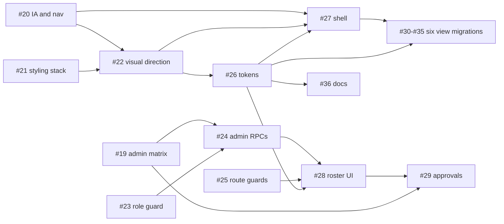

# Wayfinder Map #18 — Admin Role Model & Full UI Redesign

**Map**: [#18](https://github.com/Noahlw/efcc/issues/18) — Admin Role Model & Full UI Redesign (顯恩堂系統 Rework)
**Date**: 2026-07-28
**Supersedes**: Map [#1](https://github.com/Noahlw/efcc/issues/1) (TS WebApp migration, closed)
**Status**: Open — four decision tickets on the frontier

---

## Why this rework

Two independent problems, audited against the current `feat/webapp-migrate` tree.

### 1. `ADMIN` is a label, not a role

ADR-0005 defines a four-tier hierarchy (`ADMIN` > `STAFF` > `EVENT_LEADER` >
`MEMBER`). The implementation delivers three tiers, because nothing anywhere
grants `ADMIN` a capability `STAFF` lacks.

| Finding | Evidence |
| --- | --- |
| No administrative endpoints exist | 17 `api_*` functions in `程式碼.js`; none list users, assign roles, or approve members |
| Role assignment is a manual spreadsheet edit | No write path to the `Users.Role` column outside registration, which hardcodes `MEMBER` |
| `ADMIN` never unlocks anything alone | Every gate is `role === "MEMBER"` (deny) or `role !== "STAFF" && role !== "ADMIN"` (deny) |
| The role helper does not check the hierarchy | `checkRoleAtLeast_(userId, requiredRole)` (`程式碼.js` ~L1125) **ignores `requiredRole`** and returns the role string; all five call sites hand-roll comparisons |
| ADR-0005's specified guard was never written | The ADR prescribes `checkPermission_` with a `rolesPriority` map. No such function exists |
| `Pending` status is specified but dead | `CONTEXT.md` glossary lists `Active/Pending/Inactive`; `api_registerUser` hardcodes `"Active"` at two sites (~L599, ~L1064). Nothing reads or writes `Pending` |

The role-guard defect is the sharpest: the current code is correct only because
every author remembered to spell out the full allowed set. A fifth role, or one
author writing `role !== "STAFF"` alone, silently changes who gets in.

Frontend gating is thinner still — it exists **only** as conditional buttons
inside `MyProfileView` (L265/L275/L285). `App.tsx` renders every route on
`activeSession` being non-null, with no role check. The backend does deny the
data, so this is not a data breach; it is an authorization model with no single
place that states it.

### 2. There is no design system

| Finding | Evidence |
| --- | --- |
| `CONTEXT.md` misstates the stack | Claims "Tailwind CSS". Tailwind is not in `src/frontend/package.json` |
| Styling is per-file inline objects | ~3,900 LOC across 8 views + 3 components, each with a private `styles` object |
| Every shape is duplicated | `page`, `error`, button, and card styles are re-declared in most views |
| No shell, no navigation | `App.tsx` is a flat 8-literal `Route` union rendered by `&&` chains; 6 views take a prop-drilled `onBack` |
| Design values are hardcoded in logic | Role badge colors live as a ternary chain over hex codes inside `MyProfileView` |
| Largest files are unmaintained | `CareDashboardView.tsx` 550 LOC, `AttendanceScannerView.tsx` 494 LOC |

Bilingual (中文/English) UI and an age-diverse, phone-first congregation are
product requirements that the current UI does not address at all.

---

## Prerequisite — Vanilla Restructure (Spec 008)

ADR-0007 replaced the React SPA with a vanilla multi-page architecture. Before
any Map #18 ticket can land on the new target, the `src/gas/` directory must
exist with:

- 8 domain `.gs` files ported from `程式碼.js` (reference)
- 7 `.html` page files served via `doGet(?page=)`
- `styles.html` (shared CSS tokens)
- `app.js.html` (shared session/api/navigation JS)

| Ticket | # | Type | Blocked by |
| --- | --- | --- | --- |
| T0 — Port reference code to `src/gas/` vanilla structure | [#38](https://github.com/Noahlw/efcc/issues/38) | `task` | — |

**T0 gates the entire map.** The restructured `src/gas/` codebase is the
baseline every implementation ticket targets. Until T0 is smoke-tested and
locked, T1–T14 operate against a moving target.

After T0 lands, the dependency shape (below) is unchanged — T1 (#23) still
runs first, design decisions D1–D4 still run in parallel.

---

## Approach

Wayfinder discipline: **clear the fog before charging the destination.** Four
decisions gate the work, because their answers change the shape of the
implementation rather than merely its content.

Notably, three implementation tickets are *not* gated — the role-guard refactor
and route guards are correct regardless of any pending decision, so code can
move in parallel with the product conversations.

### Ticket roster

| Ticket | # | Type | Blocked by |
| --- | --- | --- | --- |
| D1 — Admin capability matrix & member approval flow | [#19](https://github.com/Noahlw/efcc/issues/19) | `grilling` | — |
| D2 — Redesign depth, IA & navigation model | [#20](https://github.com/Noahlw/efcc/issues/20) | `grilling` | — |
| D3 — Styling stack under the singlefile constraint | [#21](https://github.com/Noahlw/efcc/issues/21) | `research` | — |
| D4 — Two visual directions for the app shell | [#22](https://github.com/Noahlw/efcc/issues/22) | `prototype` | #20, #21 |
| T1 — Make the role guard actually compare priority | [#23](https://github.com/Noahlw/efcc/issues/23) | `task` | — |
| T2 — Admin RPC surface | [#24](https://github.com/Noahlw/efcc/issues/24) | `task` | #19 |
| T3 — Route guards & centralized routing | [#25](https://github.com/Noahlw/efcc/issues/25) | `task` | — |
| T4 — Design tokens & primitive components | [#26](https://github.com/Noahlw/efcc/issues/26) | `task` | #21, #22 |
| T5 — AppShell & role-adaptive navigation | [#27](https://github.com/Noahlw/efcc/issues/27) | `task` | #20, #22, #26 |
| T6 — Admin console: roster & role assignment | [#28](https://github.com/Noahlw/efcc/issues/28) | `task` | #24, #25, #26 |
| T7 — Admin console: pending approval queue | [#29](https://github.com/Noahlw/efcc/issues/29) | `task` | #19, #24, #28 |
| T8 — Redesign: Login & Registration | [#30](https://github.com/Noahlw/efcc/issues/30) | `task` | #26, #27 |
| T9 — Redesign: MyProfile & MemberPassModal | [#31](https://github.com/Noahlw/efcc/issues/31) | `task` | #26, #27 |
| T10 — Redesign: ProgramCatalog & ProgramEnrollment | [#32](https://github.com/Noahlw/efcc/issues/32) | `task` | #26, #27 |
| T11 — Redesign: EventManagement & CreateEventForm | [#33](https://github.com/Noahlw/efcc/issues/33) | `task` | #26, #27 |
| T12 — Redesign: AttendanceScanner & ManualSearchInput | [#34](https://github.com/Noahlw/efcc/issues/34) | `task` | #26, #27 |
| T13 — Redesign: CareDashboard | [#35](https://github.com/Noahlw/efcc/issues/35) | `task` | #26, #27 |
| T14 — Reconcile docs with the shipped stack | [#36](https://github.com/Noahlw/efcc/issues/36) | `task` | #26 |

### Dependency shape

**Critical path**: #20 + #21 → #22 → #26 → #27 → the six view migrations.

**Parallel-safe immediately**: #19, #20, #21 as decisions, alongside #23 and #25
as code.

**Widest parallelism**: once #27 lands, #30–#35 are six mutually independent
migrations.

---

## Sequencing rationale

**Why the view migrations are six tickets, not one.** Each pair is independently
shippable behind the shell, so the redesign lands incrementally instead of as
one unreviewable diff. They are ordered by risk, ascending: Login/Registration
first (simplest, highest visibility), AttendanceScanner second-to-last (the
`html5-qrcode` camera integration is the riskiest surface and is used live at a
door), CareDashboard last (largest file; needs decomposition, not just
restyling).

**Why T1 (#23) is unblocked and should go first.** It is a pure refactor with an
unchanged permission outcome, it removes the most dangerous latent defect, and
T2's admin endpoints depend on having a correct `hasRoleAtLeast_` to gate with.

**Why T7 (#29) may not exist.** If D1 decides `Pending` is vestigial, the right
outcome is deleting it from the glossary and types, not building an approval
flow nobody asked for. The ticket says so explicitly.

---

## Out of scope

- Gmail / Workspace SSO — deferred by ADR-0005.
- Replacing Google Sheets (ADR-0001) or the PIN mechanism (ADR-0002).
- New end-user features beyond the admin surface.
- The Ultracite / Oxlint toolchain migration — tracked in #15 / #16.

---

## Expected artifacts

| Document | Produced by |
| --- | --- |
| `docs/adr/0006-admin-capability-matrix.md` | D1 (#19) |
| `docs/specs/008-ui-information-architecture.md` | D2 (#20) |
| `docs/adr/0007-styling-stack.md` | D3 (#21) |
| `docs/design/d4-prototypes/` | D4 (#22) |
